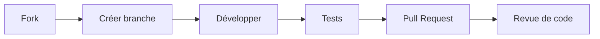

# 🔐 Norus_Pass

<div align="center">


### Un gestionnaire de mots de passe élégant, sécurisé et simple d'utilisation

[](https://www.python.org/downloads/)
[](https://opensource.org/licenses/MIT)
[](CONTRIBUTING.md)

[Fonctionnalités](#-fonctionnalités) • 
[Installation](#-installation) • 
[Utilisation](#-utilisation) • 
[Sécurité](#-sécurité) • 
[Feuille de route](#-feuille-de-route) • 
[Contribution](#-contribution)

</div>

---

## ✨ Fonctionnalités


### Interface
- 🖥️ **Interface graphique moderne** et intuitive basée sur Tkinter
- 🔍 **Recherche instantanée** de vos identifiants 
- 📋 **Gestion simplifiée** avec glisser-déposer et raccourcis clavier

### Sécurité
- 🛡️ **Chiffrement AES-256** via l'algorithme Fernet
- 🔑 **Protection par mot de passe maître** avec PBKDF2 (100 000 itérations)
- 🧂 **Salage unique** pour chaque base de données
- ⏱️ **Verrouillage automatique** après période d'inactivité

### Fonctionnalités
- 🎲 **Générateur de mots de passe robustes** personnalisable
- 📤 **Copie sécurisée** avec effacement automatique du presse-papiers
- 👁️ **Masquage intelligent** des données sensibles
- 🔄 **Synchronisation possible** avec des services cloud (bientôt)

---

## 📥 Installation

### Prérequis
- Python 3.6 ou supérieur
- Bibliothèque Cryptography

### Méthode simple

```bash
# Cloner le dépôt
git clone https://github.com/votre-username/norus_pass.git

# Naviguer dans le dossier
cd norus_pass

# Installer les dépendances
pip install -r requirements.txt

# Lancer l'application
python norus.py
```

### Avec environnement virtuel (recommandé)

```bash
# Créer un environnement virtuel
python -m venv venv

# Activer l'environnement (Windows)
venv\Scripts\activate

# Activer l'environnement (macOS/Linux)
source venv/bin/activate

# Installer les dépendances
pip install -r requirements.txt

# Lancer l'application
python norus.py
```

---

## 📖 Utilisation

<div align="center">
  <table>
    <tr>
      <td align="center"><br/><b>Connexion</b></td>
      <td align="center"><br/><b>Vue principale</b></td>
      <td align="center"><br/><b>Générateur</b></td>
    </tr>
  </table>
</div>

### 🔑 Premier démarrage

Lors de la première utilisation, créez un mot de passe maître robuste. Ce mot de passe est la clé de voûte de votre sécurité.

> ⚠️ **Important**: Ce mot de passe ne peut pas être récupéré. S'il est perdu, l'accès à vos données sera définitivement impossible.

### 📝 Gestion des identifiants

| Action | Comment faire |
|--------|---------------|
| **Ajouter** | Cliquez sur `+` ou utilisez `Ctrl+N` |
| **Modifier** | Double-cliquez sur une entrée ou sélectionnez et appuyez sur `Ctrl+E` |
| **Supprimer** | Sélectionnez et cliquez sur l'icône 🗑️ ou utilisez `Suppr` |
| **Copier** | Sélectionnez et cliquez sur l'icône 📋 ou utilisez `Ctrl+C` |
| **Générer** | Dans la fenêtre d'ajout/modification, cliquez sur 🎲 |

### 🔍 Recherche avancée

Utilisez la barre de recherche pour filtrer par:
- Nom de site
- Nom d'utilisateur
- Notes (recherche dans le contenu)
- Tags (en préfixant avec `#`)

---

## 🔒 Sécurité

SecurePass a été conçu avec la sécurité comme priorité absolue:

- **Architecture Zero-Knowledge**: Nous ne pouvons jamais accéder à vos données
- **Chiffrement de bout en bout**: Les données sont chiffrées avant de quitter votre appareil
- **Algorithmes éprouvés**: AES-256 pour le chiffrement, PBKDF2 pour la dérivation de clé
- **Pas de données en mémoire**: Les informations sensibles sont effacées de la mémoire après utilisation
- **Code source ouvert**: Transparence totale sur notre implémentation

<details>
  <summary><b>🔍 Détails techniques du chiffrement</b></summary>
  
  ```
  Algorithme: AES-256-GCM (via Fernet)
  Dérivation de clé: PBKDF2 HMAC-SHA256
  Itérations: 100 000
  Taille du sel: 16 octets (128 bits)
  Méthode de génération du sel: CSPRNG (secrets.token_bytes)
  ```
</details>

---

## 📝 Feuille de route

- [ ] **v1.1** - Import/Export (CSV, KeePass)
- [ ] **v1.2** - Support pour fichiers attachés
- [ ] **v1.3** - Synchronisation cloud (optionnelle)
- [ ] **v1.4** - Audit de sécurité des mots de passe
- [ ] **v2.0** - Applications mobiles (Android/iOS)

Votez pour les fonctionnalités futures ou proposez vos idées dans [les issues](https://github.com/votre-username/securepass/issues).

---

## 🤝 Contribution

Les contributions sont essentielles pour améliorer SecurePass! Voici comment vous pouvez nous aider:



Consultez nos [directives de contribution](CONTRIBUTING.md) pour plus de détails.

---

<div align="center">
  
### Développé avec ❤️ par CiscoDerm

<a href="https://github.com/votre-username">
  
</a>

Si Norus_Pass vous est utile, pensez à ⭐ ce dépôt!

</div>
